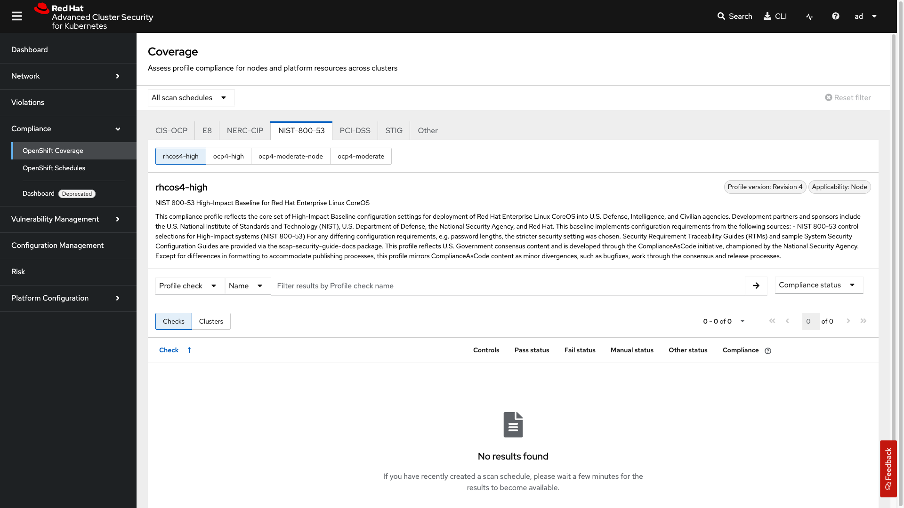

= Assurance

[[cluster-conformance]]

Assurance is critical for sovereignty, ensuring that applications operate in a compliant manner and that clusters maintain compliance across diverse regions and geographies. It is essential to have confidence that compliance reports are accurate, testable, and auditable, thereby supporting and advancing key business objectives. Additionally, enabling teams to collaborate effectively through the use of appropriate tools and technologies helps drive organizational success.

*Achieving this level of assurance requires a practical and structured approach.*

So let's get practical in our example of an EMEA environment and a US environment and observe, audit, police and manage our clusters and application applications. We will start by looking at the security, compliance and environment insights that we can get from Red Hat Advanced Cluster Security for Kubernetes (RHACS).

== Security and Environment Insights

**First let's review the basics of RHACS.**

[[rhacs-insights]]

=== *RHACS Basics*
RHACS provides developers and administrators with tools to meet the security needs of cloud-native development on Kubernetes. Its features address primary security concerns across various environments, including datacenters, private clouds, and public clouds running Kubernetes clusters. With RHACS, you can achieve comprehensive security, covering key areas such as:

*Vulnerability Management*  
Protect nodes, platforms, and applications from vulnerabilities using prioritization and impact-based filters.

*Network Security*  
Gain real-time visibility, enforce network policies, detect anomalies, and manage app-centric network access controls.

*Security Policy Guardrails*  
Ensure consistent, compliant, and secure configurations with RHACS' built-in policy guardrails.

*Compliance*  
Make sure clusters meet regulatory and contractual requirements, such as DISA-STIG and PCI-DSS, with simple audit capabilities.

*Risk Profiling*  
Identify and prioritize security risks using key impact and severity metrics for OpenShift and Kubernetes clusters.

*Threat Detection and Response*
Implement process and network controls to detect malicious runtime incidents and respond using Kubernetes-native enforcement.

=== RHACS Console Access

Your RHACS Console is available in the showroom environment. In case you want to open it in another window it is here:  {acs_route}[window=blank]

Administrator login is available with:

[cols="1,1"]
|===
| *RHACS Console Username:* | {acs_portal_username} 
| *RHACS Console Password:* | {acs_portal_password} 
|===

== RHACS Compliance Operator Installation and Compliance Checks

[[conformance-tests]]

Before making changes to your cluster, it’s essential to understand your current compliance posture. Red Hat Advanced Cluster Security (RHACS) seamlessly integrates with the OpenShift Compliance Operator to provide out-of-the-box compliance checks—including industry standards such as E8 and DISA STIG. You can also define custom profiles that combine multiple standards into one, streamlining your audit processes and allowing you to easily tailor compliance requirements to your organization or region. This flexibility enables you to create global profiles and maintain consistent, auditable compliance across all OpenShift environments.

=== Checking Your Compliance Posture

The first step to any changes in a cluster is to analyze what you need to change RHACS integrates with the compliance operator to bring you a variety of compliance checks from the E8 to DISA STIG and more. RHACS can also set up custom compliance checks so you can create profiles that have both DISA STIG and E8 standards together for easier auditing and to create a profile that can become global if necessary.

[start=1]
. Click on the *Compliance* -> *OpenShift Schedules* tab.

image::assurance-01.png[link=self, window=blank, width=100%]

[start=2]
. Next, click on the *Create scan schdule*.

image::assurance-02.png[link=self, window=blank, width=100%]

[start=3]
. Next, fill in the form with the following information:

* Name:
+
[source,bash]
----
acs-catch-all
----
* Description:
+
[source,bash]
----
Daily compliance scan for all profiles covering CIS, E8, Moderate, NERC-CIP, PCI-DSS, and STIG standards for both platform and node-level checks
----
* Frequency: *Daily*
* Time: 00:00 UTC

. Click Next
. Select the clusters: *production*
. Click Next
. Add the following profiles (in order):
    * ocp4-cis (99 rules, Platform, Version 1.5.0)
    * ocp4-cis-node (100 rules, Node, Version 1.5.0)
    * ocp4-e8 (14 rules, Platform)
    * ocp4-moderate (136 rules, Platform, Revision 4)
    * ocp4-moderate-node (120 rules, Node, Revision 4)
    * ocp4-nerc-cip (133 rules, Platform)
    * ocp4-nerc-cip-node (120 rules, Node)
    * ocp4-pci-dss (120 rules, Platform, Version 3.2.1)
    * ocp4-pci-dss-node (114 rules, Node, Version 3.2.1)
    * ocp4-stig (50 rules, Platform, Version V2R1)

NOTE: There are many profiles to select but here we are selecting the most common profiles that are used in most organizations. If you want to only add the ones necessary for the lab. Select ......

[start=8]
. Click Next

[NOTE]
====
We will not add a delivery destination so we will skip this step. However you can send notifications via email, get details via API or download reports via the console.
====

[start=9]
. Click Next
. Review your masterpiece and click *Save*

image::assurance-05.png[link=self, window=blank, width=100%]

You should see the new schedule in the list and it will be performing it's first scan. If you click the 3 dots on the right side of the schedule you can trigger a manual scan, download the report or delete the schedule.

image::assurance-06.png[link=self, window=blank, width=100%]

[start=11]

.Head over to the OpenShift coverage section where you can view all of the details from the scan.

[IMPORTANT]
====
 The RHACS compliance coverage dashboard provides a comprehensive overview of your scan schedules and results. In the Coverage tab, you can review all scan schedules or filter to view specific schedules such as the "acs-catch-all". Each scan displays coverage across a variety of compliance standards—including CIS, OCP, E8, NERC-CIP, NIST 853, PCI-DSS, and DISA-STIG. You can filter results by specific checks for greater detail. On the right side of the dashboard, you’ll see the cluster’s overall compliance status, along with a breakdown of which checks are passing or failing.
====

=== Analyze Compliance Results

Managing multi-region and multi-geo environments presents specific challenges. Typically, changes are initiated by the operations team, who are responsible for provisioning and managing the infrastructure. They also oversee any modifications needed to enhance security or ensure compliance with applicable standards. Establishing clear processes and leveraging automation can help maintain consistency and compliance across all environments. In OpenShift, cluster changes are done by the administrator or the operations team through the OpenShift console with Red Hat Advanced Cluster Management for Kubernetes (RHACM) providing the governance and policy capabilities.

=== Make a Simple Cluster Change to Pass the Compliance Check

Let's focus on the ocp4-e8 compliance checks. To pass the `ocp4-e8-ocp-allowed-registries` standard, you need to set an allowlist of container registries that OpenShift can pull images from. 

First let's take a look at the standard;

[start=1]
. Click on the *Compliance* -> *OpenShift Coverage* -> *E8* tab.

image::compliance-01.png[link=self, window=blank, width=100%]

[start=2]
Let's first check the failing standards by sorting by compliance status.

image::compliance-02.png[link=self, window=blank, width=100%]
image::compliance-03.png[link=self, window=blank, width=100%]

[start=3]
. And then clicking on the failing standard 'ocp4-e8-ocp-allowed-registries'.

Here you will see both the clusters impacted by this failing standard and guidance on how to resolve the issue.

[start=4]
. Click on the *Details* tab next to *Results* and review the findings for the failing check. 

To address this, limit the set of container registries that OpenShift is allowed to pull images from by configuring the cluster with a new allowlist. We will do this by applying a YAML configuration as an OpenShift administrator, and then re-scan the cluster to verify compliance.

[start=5]
. Create the Image Configuration YAML by copying and pasting the following into the bastion host terminal.

[IMPORTANT]
====
Ensure you are logged in to OpenShift before running this command. If you receive an "Unauthorized" error, log in first using:

[source,sh]
----
oc config use-context local-cluster
oc apply -f - <<EOF
apiVersion: config.openshift.io/v1
kind: Image
metadata:
  name: cluster
spec:
  registrySources:
    allowedRegistries:
      - quay.io
      - registry.redhat.io
      - registry.access.redhat.com
      - image-registry.openshift-image-registry.svc:5000
      - gcr.io
      - docker.io
EOF
----

[INFORMATION]
====
- `image-registry.openshift-image-registry.svc:5000` is needed for OpenShift’s own internal image registry.
- Add/remove registries as needed for your environment.
- Any registry used in your cluster must be in this list to pass the policy.
====

[start=6]
. Check that your changes have been accepted:

[source,sh]
----
oc get image.config.openshift.io/cluster -o yaml | grep allowedRegistries -A 10
----

**Output**
[source,sh]
----
    allowedRegistries:
    - quay.io
    - registry.redhat.io
    - registry.access.redhat.com
    - image-registry.openshift-image-registry.svc:5000
    - my-trusted-registry.internal.example.com
    - quay.io
status:
  internalRegistryHostname: image-registry.openshift-image-registry.svc:5000
----

[start=7]
**Verification**

. To verify remediation and compliance with the `ocp4-e8-ocp-allowed-registries` requirement:

.. Go back to the *RHACS* console.
.. Navigate to *Compliance* → *Scan Schedules* and locate your schedule (for example, `acs-catch-all`).
.. Use the menu on the schedule (three dots) and select "Run scan" to trigger a manual scan.

**Check Results**

[start=8]

.Click on the *Compliance* -> *OpenShift Coverage* -> *E8* tab.

- The `ocp4-e8-ocp-allowed-registries` check should now pass, showing your registry restrictions are correctly configured.
- If the check still fails, double-check your YAML for typos or missing registries in use by workloads.

[IMPORTANT]
====
Changes to Image configuration may take a few minutes to propagate in OpenShift. If the compliance check still fails after rescanning, wait a few minutes and run the scan again.
====

Here are the key points simplified into 5 sentences:

Updating your allowed image registries is one of the fastest and most effective ways to improve security and compliance in OpenShift. Other quick hardening steps include enabling audit log forwarding and activating host node auditing with Linux auditd. These security configurations can be applied consistently across the entire cluster using the MachineConfig Operator. 

For even better results, you can automate these settings so new clusters are secure and compliant from the moment they are created. Tools like Ansible, Advanced Cluster Management (RHACM), or GitOps workflows make this automation straightforward and reliable.

== Maintaining Control in Sovereign & Multi-Region Environments

In sovereign cloud setups, strict control over what runs inside your infrastructure is essential for data protection, regulatory compliance, and operational independence.

Red Hat Advanced Cluster Security (RHACS) includes built-in policies that detect and block risky behaviors such as unauthorized access attempts, persistent threats, lateral movement, and data exfiltration. These policies help you enforce the immutable container principle — containers should only run exactly what you approved, with no unexpected changes.

== Next Step: Block Package Managers at Runtime

Package managers such as apt, apk, yum, and dnf are useful on virtual machines, but they have no place in production containers. Allowing them enables uncontrolled software installation, dramatically increases the attack surface, and breaks auditability and immutability — all of which are core requirements for sovereign cloud environments.

Bottom line: No package manager execution means no unauthorized changes — resulting in more secure, more auditable, and more compliant containers.

Now, our security and operations teams want simplifed workflows and flexibility in where to deploy their applications. Policy-as-Code is a great way to achieve this.

*Procedure*

. On the left-hand side of the application, click the *Platform Configuration* tab and select *Policy Management*.

image::04-acs-policy-00.png[link=self, window=blank, width=100%, Policy Management Dashboard]

[start=2]

. Filter through the policies to find *Alpine Linux Package Manager Execution* or use the search bar to select *Policy* then *Alpine Linux Package Manager Execution*.

image::04-acs-policy-01.png[link=self, window=blank, width=100%, Policy Management Search]

[start=3]

. Once you have found the policy *Alpine Linux Package Manager Execution* click on the three dots then click *Clone policy*.

image::04-acs-policy-02.png[link=self, window=blank, width=100%]

NOTE: This is a system policy. If you change a system policy they get reset upon the next release. It is always best practice to clone such policies. 

[start=4]

. Give the policy a new name: *Alpine Linux Package Manager Execution - Enforce*

image::04-acs-policy-03.png[link=self, window=blank, width=100%]

[start=5]

. Click *Next*

image::04-acs-policy-04.png[link=self, window=blank, width=100%]

[start=6]

. The lifecycle stages don't need to be changed so click *Next*
. The *rules* don't need to be changed either since you are already targeting the *apk* process. Click *Next*

image::04-acs-policy-05.png[link=self, window=blank, width=100%]

====
The Policy behavior section allows you to exclude specific deployments from this policy. Some RHACS users have golden applications that they always want excluded from enforcement policies. This would be where you add those exceptions. 
====

[start=8]
. Click *Next*
. In the *Policy behavior -> Actions* tab select *inform and enforce* 
. Enable runtime enforcement by clicking the *inform and enforce* button.
. Configure enforcement behavior by selecting *Enforce at Runtime*.
. Click *Next*

image::04-acs-policy-06.png[link=self, window=blank, width=100%, Enforce Runtime Policy]

[start=13]

. Review the policy changes
. Click *Save*

IMPORTANT: Make sure to save the policy changes! If you do not save the policy, the process will not be blocked!

=== Testing the runtime policy

Next, you will use tmux to watch OpenShift events while running the test so you can see how RHACS enforces the policy at runtime.

*Procedure*
[start=1]

. start tmux with two panes:

[source,sh,role=execute]
----
tmux new-session \; split-window -v \; attach
----

[start=2]

. Next, run a watch on OpenShift events in the first shell pane:

[source,sh,role=execute]
----
oc get events -n patient-portal -w
----

[start=3]

. Press *Ctrlb, o* to switch to the next pane. (Ctrlb THEN o)
. Exec into our *patient-frontend* application by getting the pod details and adding them to the following command.

[source,sh,role=execute]
----
POD=$(oc get pod -n patient-portal -l app=frontend -o jsonpath="{.items[0].metadata.name}")
oc exec -n patient-portal $POD -i --tty -- /bin/sh
----

*Sample output*
[source,bash]
----
[demo-user@bastion ~]$ POD=$(oc get pod -n patient-portal -l app=frontend -o jsonpath="{.items[0].metadata.name}") 
oc exec -n patient-portal $POD -i --tty -- /bin/sh
/home/fritz $ 
----

NOTE: If you see */home/fritz $* you've confirmed you have a shell and access to the frontend application.

[start=5]
. Run the alpine package manager in this shell:

[source,sh,role=execute]
----
apk update
----

. Examine the output and expect to see that the package manager attempts to perform an update operation:

[source,texinfo,subs="attributes"]
----
/home/fritz $ apk update
ERROR: Unable to lock database: Permission denied
ERROR: Failed to open apk database: Permission denied
/home/fritz $ command terminated with exit code 137
[demo-user@bastion ~]$ 
----

[start=6]
. Examine the oc get events tmux pane (The pane on the bottom), and note that it shows that RHACS detected the package manager invocation and deleted the pod:

[source,texinfo,subs="attributes"]
----
^C^C[demo-user@bastion ~]$ oc get events -n patient-portal -w
LAST SEEN   TYPE      REASON                 OBJECT                           MESSAGE
50s         Normal    Killing                pod/frontend-8667d5c56b-f9fcj    Stopping container frontend
50s         Normal    Scheduled              pod/frontend-8667d5c56b-s6dph    Successfully assigned patient-portal/frontend-8667d5c56b-s6dph to ip-10-0-61-109.us-east-2.compute.internal
49s         Normal    AddedInterface         pod/frontend-8667d5c56b-s6dph    Add eth0 [10.131.0.167/23] from ovn-kubernetes
49s         Normal    Pulling                pod/frontend-8667d5c56b-s6dph    Pulling image "quay-czscm.apps.cluster-czscm.czscm.sandbox478.opentlc.com/quayadmin/frontend:0.1"
49s         Normal    Pulled                 pod/frontend-8667d5c56b-s6dph    Successfully pulled image "quay-czscm.apps.cluster-czscm.czscm.sandbox478.opentlc.com/quayadmin/frontend:0.1" in 46ms (46ms including waiting). Image size: 117738460 bytes.
49s         Normal    Created                pod/frontend-8667d5c56b-s6dph    Created container frontend
49s         Normal    Started                pod/frontend-8667d5c56b-s6dph    Started container frontend
50s         Normal    SuccessfulCreate       replicaset/frontend-8667d5c56b   Created pod: frontend-8667d5c56b-s6dph
50s         Warning   StackRox enforcement   deployment/frontend              A pod (frontend-8667d5c56b-f9fcj) violated StackRox policy "Alpine Linux Package Manager Execution - Enforce" and was killed
----

NOTE: After a few seconds, you can see the pod is deleted and recreated. In your tmux shell pane, note that your shell session has terminated and that you are returned to the Bastion VM command line.

[start=7]

. Type exit in the terminal, use ctrl+c to stop the 'watch' command, and type exit one more time to get back to the default terminal.

Congrats! You have successfully stopped yourself from downloading malicious packages! However, the security investigative process continues, as you have now raised a flag that must be triaged! you will triage our violations after you look at deploy time policies.

== Report and Resolve Violations

In this section, you will resolve a few of the issues that you have created.

*Procedure*

. Navigate to the Violations page.
. Filter by the policy violation Policy - Name - r/apk OR by the most recent policy violations. You will see a policy violation that has been enforced.
. Click the most recent violation and explore the list of the violation events.

image::04-acs-violations.png[link=self, window=blank, width=100%, Violations Menu]

If configured, each violation record is pushed to a Security Information and Event Management (SIEM) integration and is available to be retrieved via the API. The forensic data shown in the UI is recorded, including the timestamp, process user IDs, process arguments, process ancestors, and enforcement action.

IMPORTANT: You must resolve the issue before it can be marked as resolved.

[start=4]
. Remove the deployment that violates the policy.

[source,sh,subs="attributes",role=execute]
----
oc delete -f $TUTORIAL_HOME/skupper-demo/frontend.yml
----

[start=5]
. After addressing the issue, mark the violation as resolved.

image::04-acs-resolve.png[link=self, window=blank, width=100%]

== Implement Policy-as-Code in ACM with OpenShift GitOps

Your last task is to externally manage ACS policies through OpenShift GitOps. To make this easier, the policies from before have already been exported to a GitHub repository.

link:https://github.com/mfosterrox/skupper-security-demo/tree/main/PaC-custom-policies[PaC Custom Policies on GitHub]

*Procedure*

. Navigate to OpenShift GitOps: Go to the OpenShift Console and search for "OpenShift GitOps"
. Create a new GitOps Application: In the GitOps dashboard, click on "New Application" to create a new application.
. Configure the Application:
Name: Give the application a name, e.g., pac-custom-policies.
. Select the Argo server, "openshift-gitops"
. Hit "Next"
. Enter the URL of the GitHub repository containing the custom policies (https://github.com/mfosterrox/skupper-security-demo.git).
. Select "Main"
. Select "PaC-custom-policies"
. Enter the remote namespace of "stackrox"
. Make sure the "Replace resources instead of applying changes from the source repository" is selected.
. *Deploy application resources on clusters with all specified labels*
* Cluster sets: *default*
* Label: *local-cluster*
* Operator: *equals any of*
* Value: *true*

== Conclusion

In this lab, you used Red Hat Advanced Cluster Security for Kubernetes (RHACS) to identify potential security violations in your cluster through a central dashboard. You created both deploy-time and runtime policies to help prevent malicious activities from occurring.

This lab aimed to demonstrate the significant value RHACS and OpenShift Platform Plus provide in enhancing cluster security. Feel free to continue exploring the RHACS lab environment to deepen your understanding.

=== Enhance Multi-cluster Audit Capabilities

oc get clusterlogforwarders -n openshift-logging -ojson | jq -r '.items[].spec.pipelines[].inputRefs | contains(["audit"])'

# Simple one-liner for demo (exposes Loki on http://localhost:3100)
podman run -d -p 3100:3100 --name loki grafana/loki:latest

# Run Grafana (connects to Loki)
podman run -d -p 3000:3000 --name grafana -e "GF_SECURITY_ADMIN_PASSWORD=admin" grafana/grafana:latest

oc create namespace openshift-logging
oc -n openshift-logging create secret generic loki-demo-secret \
  --from-literal=username=demo --from-literal=password=secret

# clf-external-audit.yaml
apiVersion: logging.openshift.io/v1   # or observability.openshift.io/v1 in newer Logging 6.x+
kind: ClusterLogForwarder
metadata:
  name: instance
  namespace: openshift-logging
spec:
  outputs:
    - name: external-loki
      type: loki
      loki:
        url: http://<your-host-ip-or-hostname>:3100  # e.g., http://192.168.1.100:3100 or http://host.docker.internal:3100
        # For HTTPS: https://... and add tls: { insecureSkipVerify: true } for demo
      # If auth needed: secret: { name: loki-demo-secret }
  pipelines:
    - name: audit-to-external
      inputRefs:
        - audit
      outputRefs:
        - external-loki
        # Optional: - default  # also keep internal for quick view